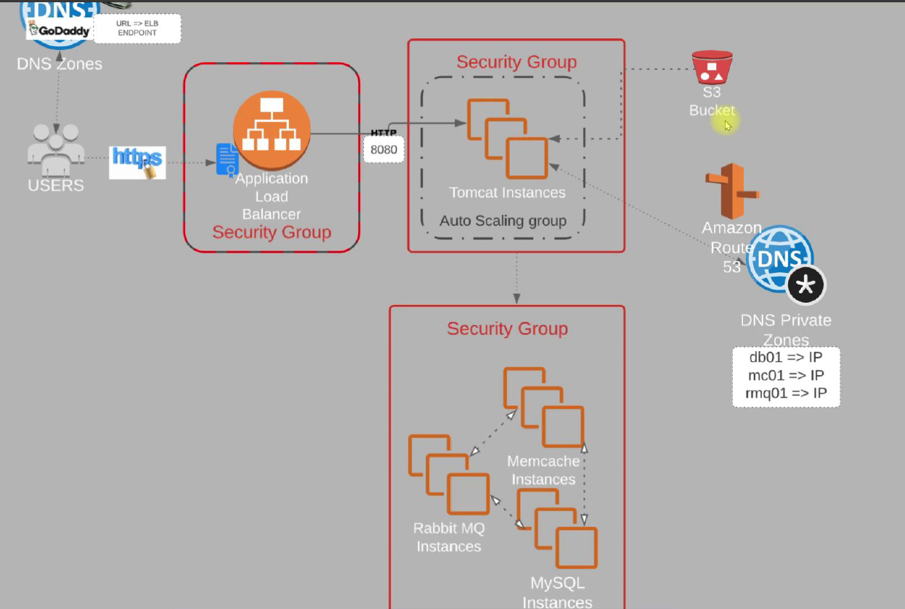

# vProfile DevOps Project - Full Stack Deployment on AWS

This project demonstrates the deployment of the **vProfile** full-stack LAMP-based web application on **AWS Cloud** using best DevOps practices. It includes infrastructure provisioning, service configuration, load balancing, internal DNS, and HTTPS setup.

---

## 🚀 Project Overview

- **Application Stack**: Java-based WAR application deployed on Apache Tomcat 10
- **Backend Services**:
  - MySQL (Database)
  - RabbitMQ (Messaging Queue)
  - Memcached (In-memory Cache)
- **Cloud Platform**: Amazon Web Services (AWS)

---

## 🧰 Technologies & Services Used

### 🔧 Application Components

| Component    | Technology         |
|--------------|--------------------|
| App Server   | Apache Tomcat 10   |
| Database     | MySQL              |
| Cache        | Memcached          |
| Queue        | RabbitMQ           |

### ☁️ AWS Services

- **EC2** – Compute instances for each service
- **S3** – Storage for WAR files or backup (optional)
- **ELB (ALB)** – Application Load Balancer for HTTPS traffic
- **ACM** – SSL/TLS certificate for secure HTTPS
- **Auto Scaling** – App server scaling based on load
- **Route 53 (Private Hosted Zone)** – Internal DNS for backend services
- **IAM** – Access control

---

## 📐 Architecture Diagram

---

## 🛠️ Deployment Structure

Four EC2 instances were deployed, each configured with shell scripts:

| Instance       | Purpose                 |
|----------------|--------------------------|
| `app01`        | Tomcat 10 + Application  |
| `db01`         | MySQL Database           |
| `mq01`         | RabbitMQ                 |
| `mc01`         | Memcached                |

---

## ⚙️ Configuration Steps

### 🔹 1. Infrastructure Setup
- Launch 4 EC2 instances
- Assign security groups with specific access rules (e.g., allow app to DB port 3306)
- Set up Route 53 private hosted zone:
  - `db01.vprofile.in`
  - `mq01.vprofile.in`
  - `mc01.vprofile.in`

### 🔹 2. Service Installation
Use provided shell scripts from `/scripts/` directory to set up each service:

# Example
sudo bash setup-appserver.sh

### 3. Tomcat Deployment (with S3 Artifact)
The application .war file (ROOT.war) was built locally using Maven.

The artifact was uploaded to an S3 bucket for centralized access and versioning.

On the app server, the .war file was fetched from S3 and deployed to Tomcat:

bash
Copy
Edit
# Example commands
aws s3 cp s3://my-bucket-name/ROOT.war /opt/tomcat/webapps/

###  4. Application Configuration (application.properties)

db.host=db01.vprofile.in
memcached.host=mc01.vprofile.in
rabbitmq.host=mq01.vprofile.in

These internal domains are mapped via private Route 53 hosted zone.

 ### 5. SSL/TLS with ACM and ELB

ACM certificate created and verified via GoDaddy (CNAME record)

Certificate attached to HTTPS listener on ELB

Target group forwards traffic to Tomcat port (e.g., 8080)

### 6. Auto Scaling and S3-backed Deployment

When a new EC2 instance is launched via ASG:

User data script installs Tomcat

Pulls the latest .war from S3

Starts the application

####7. Domain and DNS

Public domain (vprofile.in) purchased via GoDaddy

DNS pointed to ALB DNS name using CNAME or A record

ACM certificate verified using CNAME record in GoDaddy

Internal EC2 DNS (*.vprofile.in) managed using private hosted zone in Route 53

Final Outcome

Fully functional LAMP stack Java app hosted on AWS

HTTPS-secured via ACM and ELB

Horizontal scalability with Auto Scaling

All services discoverable internally via Route 53 DNS

Infrastructure provisioned and bootstrapped with bash scripts
